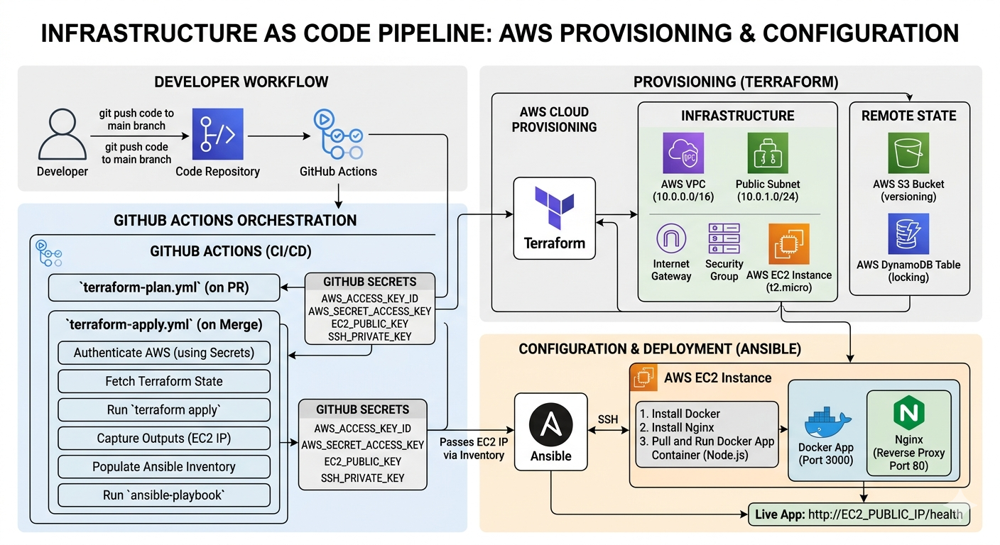
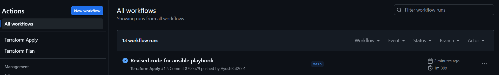
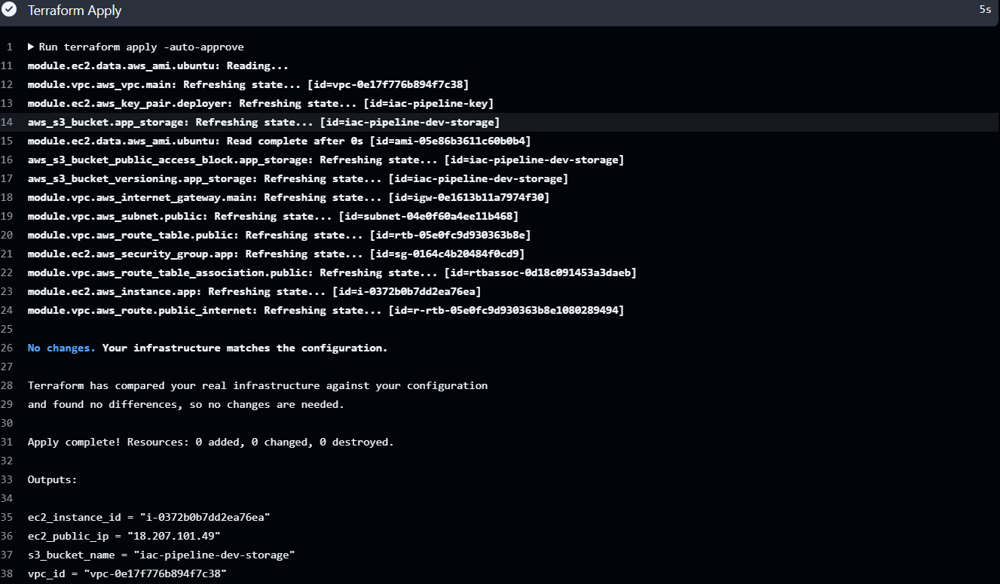
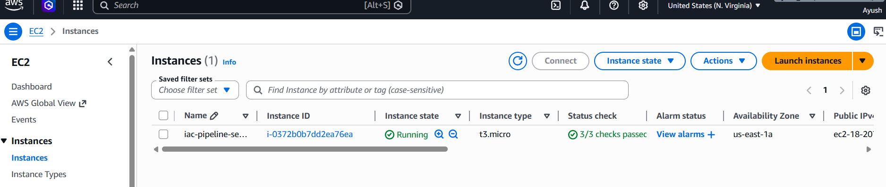
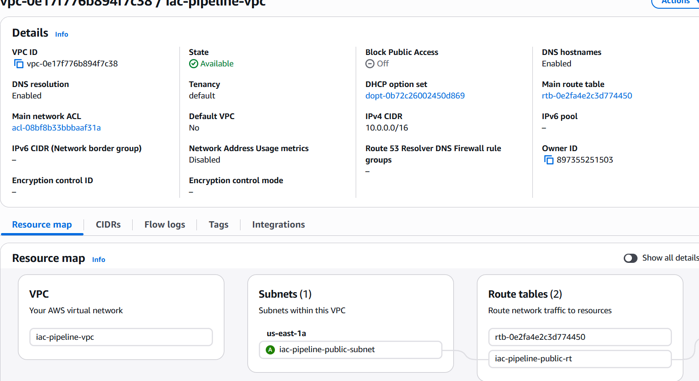
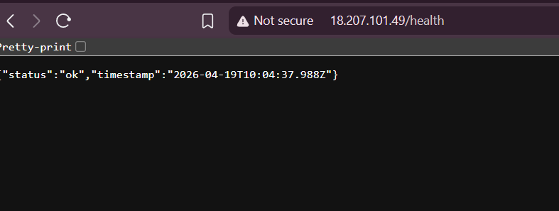

<div align="center">

# Infrastructure as Code Pipeline

**Fully automated AWS infrastructure provisioning using Terraform and Ansible.**
Push code to main. GitHub Actions provisions the entire AWS environment and configures the server automatically — no manual clicks in the AWS console.

</div>

---

## What is this?

I built this to understand how infrastructure is managed at scale — specifically how teams provision and configure cloud environments without touching the AWS console directly.

The idea: your entire infrastructure is code. A VPC, subnet, EC2 server, S3 bucket, security groups — all defined in Terraform files. Ansible configures the server once it's up. GitHub Actions runs the whole thing automatically on every merge to main. Change a variable, push, and the infrastructure updates itself.

---

## How it works

---


---

## Stack

<table>
  <tr>
    <th>Tool</th>
    <th>Purpose</th>
  </tr>
  <tr>
    <td>Terraform</td>
    <td>Provisions all AWS infrastructure from code</td>
  </tr>
  <tr>
    <td>Ansible</td>
    <td>Configures the EC2 server after provisioning</td>
  </tr>
  <tr>
    <td>GitHub Actions</td>
    <td>Orchestrates the full pipeline on every push</td>
  </tr>
  <tr>
    <td>AWS EC2</td>
    <td>Ubuntu server running the application</td>
  </tr>
  <tr>
    <td>AWS VPC</td>
    <td>Private network with public subnet and internet gateway</td>
  </tr>
  <tr>
    <td>AWS S3</td>
    <td>Remote Terraform state storage and app storage</td>
  </tr>
  <tr>
    <td>AWS DynamoDB</td>
    <td>Terraform state locking — prevents concurrent runs</td>
  </tr>
  <tr>
    <td>Docker</td>
    <td>Runs the Node.js app in a container on the server</td>
  </tr>
  <tr>
    <td>Nginx</td>
    <td>Reverse proxy forwarding port 80 traffic to the app</td>
  </tr>
</table>

---

## AWS Infrastructure created

```
VPC (10.0.0.0/16)
└── Public Subnet (10.0.1.0/24)
    ├── Internet Gateway
    ├── Route Table
    ├── Security Group (ports 22, 80, 3000)
    └── EC2 Instance (Ubuntu 22.04, t2.micro)

S3 Bucket (versioning enabled, public access blocked)
```

Everything stays within the AWS free tier.

---

## Project Structure

```
iac-pipeline/
├── terraform/
│   ├── main.tf                     # Root module — connects everything
│   ├── variables.tf                # All configurable values
│   ├── outputs.tf                  # Prints EC2 IP and resource IDs after apply
│   ├── backend.tf                  # Remote state stored in S3 + DynamoDB locking
│   └── modules/
│       ├── vpc/
│       │   ├── main.tf             # VPC, subnet, internet gateway, route table
│       │   ├── variables.tf        # Module inputs
│       │   └── outputs.tf          # Exposes VPC ID and subnet ID
│       └── ec2/
│           ├── main.tf             # EC2 instance, security group, key pair
│           ├── variables.tf        # Module inputs
│           └── outputs.tf          # Exposes public IP and instance ID
├── ansible/
│   ├── playbook.yml                # Master configuration playbook
│   ├── inventory.ini               # Generated automatically by GitHub Actions
│   └── roles/
│       ├── docker/
│       │   └── tasks/main.yml      # Installs and starts Docker
│       └── nginx/
│           └── tasks/main.yml      # Installs Nginx as reverse proxy
└── .github/
    └── workflows/
        ├── terraform-plan.yml      # Runs on every PR — shows what will change
        └── terraform-apply.yml     # Runs on merge to main — applies changes + runs Ansible
```

---

## CI/CD Workflows

**`terraform-plan.yml`** — triggers on every PR touching `terraform/`

Runs `terraform fmt`, `terraform validate`, and `terraform plan`. Shows exactly what will be created, changed, or destroyed before anything is merged. Prevents broken infrastructure config from ever reaching main.

**`terraform-apply.yml`** — triggers on every merge to main touching `terraform/`

Runs the full pipeline end to end — `terraform apply` to provision AWS resources, reads the EC2 public IP from Terraform outputs, writes it to Ansible inventory, sets up SSH, installs Ansible, and runs the playbook to configure the server and deploy the app.

### Pipeline Success and Resources Initialized


---


---


---



## Security — GitHub Secrets

All sensitive credentials are stored as GitHub Actions secrets. Nothing is hardcoded anywhere in the codebase.

<table>
  <tr>
    <th>Secret Name</th>
    <th>What it is</th>
    <th>Where it's used</th>
  </tr>
  <tr>
    <td><code>AWS_ACCESS_KEY_ID</code></td>
    <td>IAM user access key for Terraform to provision AWS resources</td>
    <td>Both workflows — authenticates with AWS</td>
  </tr>
  <tr>
    <td><code>AWS_SECRET_ACCESS_KEY</code></td>
    <td>IAM user secret key paired with the access key above</td>
    <td>Both workflows — authenticates with AWS</td>
  </tr>
  <tr>
    <td><code>EC2_PUBLIC_KEY</code></td>
    <td>SSH public key uploaded to AWS as a key pair for EC2 access</td>
    <td>Terraform apply — creates the key pair on AWS so Ansible can SSH in</td>
  </tr>
  <tr>
    <td><code>SSH_PRIVATE_KEY</code></td>
    <td>SSH private key matching the public key above</td>
    <td>Ansible — used to SSH into the EC2 instance and configure it</td>
  </tr>
</table>

To set these up go to your repo → **Settings** → **Secrets and variables** → **Actions** → **New repository secret**.

---

## Running locally

**Prerequisites:** Terraform, Ansible (WSL on Windows), AWS CLI configured

```bash
# Set AWS credentials
export AWS_ACCESS_KEY_ID=your_key
export AWS_SECRET_ACCESS_KEY=your_secret
export AWS_DEFAULT_REGION=us-east-1

# Navigate to terraform folder
cd terraform

# Initialize — downloads AWS provider
terraform init

# Preview what will be created
terraform plan

# Apply — provisions everything on AWS
terraform apply
```

After apply completes, visit `http://YOUR_EC2_IP/health` — the app should be responding.

### App Running on the EC2 Instance
---


---

## Destroying resources

Always destroy when done to avoid AWS charges:

```bash
cd terraform
terraform destroy
```

> Note: The S3 state bucket and DynamoDB lock table are created manually and are not managed by Terraform — they will not be destroyed by this command. Delete them manually in the AWS console when the project is fully complete.

---

## What I learned building this

The biggest shift was understanding why remote state matters. Local state works fine alone but the moment GitHub Actions runs Terraform in a fresh environment every time, there's no local state to reference — it would try to recreate everything from scratch on every run. Storing state in S3 with DynamoDB locking solves both problems: state persists across runs and concurrent applies are blocked.

The other interesting part was chaining Terraform and Ansible together in one pipeline. Terraform outputs the EC2 IP, GitHub Actions reads it and writes it directly into Ansible's inventory file, then Ansible picks it up and configures the fresh server. No manual steps between provisioning and configuration — the whole thing runs unattended from a single git push.
